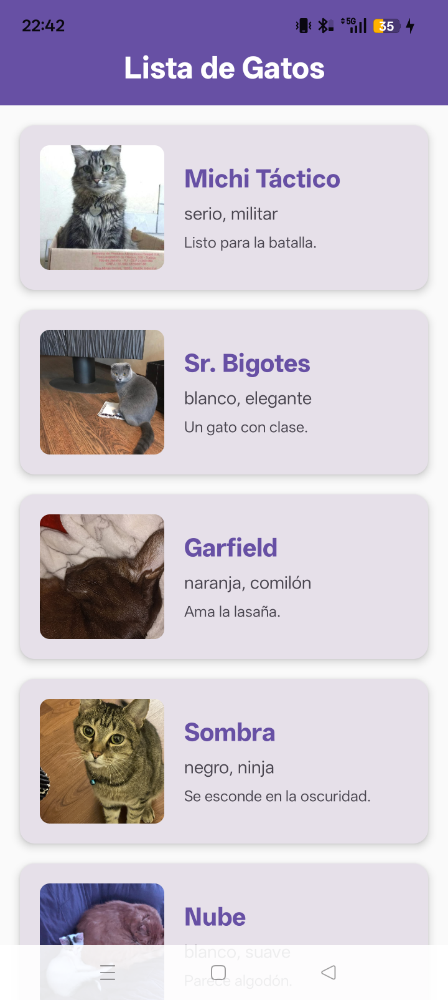
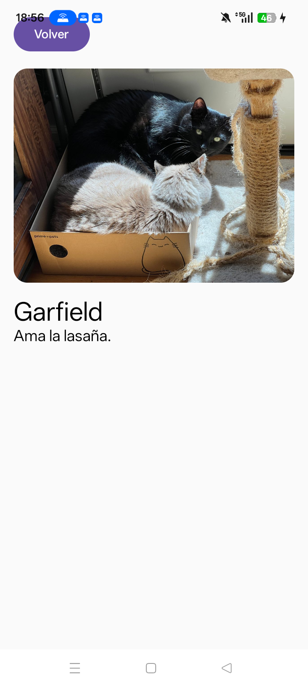

# Lazy Components - Galería de Gatos

## Descripción del Proyecto
Aplicación Android desarrollada con Jetpack Compose que muestra una lista de gatos utilizando Lazy Components y siguiendo el patrón MVVM con LiveData.

## Características Principales
- **Arquitectura MVVM**: Separación clara entre UI, lógica de negocio y datos
- **Lazy Components**: Uso eficiente de LazyColumn para listas grandes
- **LiveData**: Gestión reactiva del estado de la aplicación
- **Navegación**: Sistema completo de navegación entre pantallas
- **Consumo de API**: Datos simulados de una API

## Capturas de Pantalla
| Pantalla Principal | Vista Detallada |
|-------------------|-----------------|
|  |  |

## Estructura del Proyecto
```
com.example.lazycomponents/
├── model/
│   └── Gat.kt
├── viewmodel/
│   └── GatViewModel.kt     # ViewModel con LiveData
├── view/
│   └── Screen.kt           # Pantallas con Jetpack Compose
├── nav/
│   └── Routes.kt           # Rutas de navegación
├── nav/                    # Sin cambios
└── MainActivity.kt
```

## API Utilizada
- **Nombre**: Cat as a Service (CatAAS)
- **URL**: https://cataas.com/
- No requiere API key

## Modelo de Datos
```kotlin
data class Gat(
    val id: String,
    val nombre: String,
    val tags: List<String>,
    val urlImagen: String,
    val descripcion: String
)
```

## Funcionalidades Implementadas

### Pantalla Principal
- Lista de 8 gatos usando LazyColumn
- Cada elemento muestra:
  - Imagen del gatete
  - Nombre del gatete
  - Color y adjetivo estrella del mismo
- Diseño con tarjetas clickables
- Scroll suave

### Pantalla de Detalle
- Imagen en tamaño grande
- Nombre del gatito
- Descripción del gatito

## Gatos Incluidos en la Aplicación
1. **Michi Táctico** - Listo para la batalla
2. **Sr. Bigotes** - Un gato con clase
3. **Garfield** - Ama la lasaña
4. **Sombra** - Se esconde en la oscuridad
5. **Nube** - Parece algodón
6. **Manchas** - Nunca para quieto
7. **Dormilón** - Siempre descansando
8. **Hacker** - Arreglando bugs

## Puntos Fuertes del Proyecto
1. **Código limpio y bien organizado**
2. **Arquitectura MVVM**
3. **Uso de LiveData**
4. **Componentes lazy para optimización**
5. **Navegación completa y funcional**
6. **Documentación adecuada**

## Autores
Lucía Martinez <br>
Pol González <br>
Módulo 0488: Desarollo de interfaces

## Licencia
Este proyecto está desarrollado con fines educativos. Las imágenes son proporcionadas por CatAAS API.
